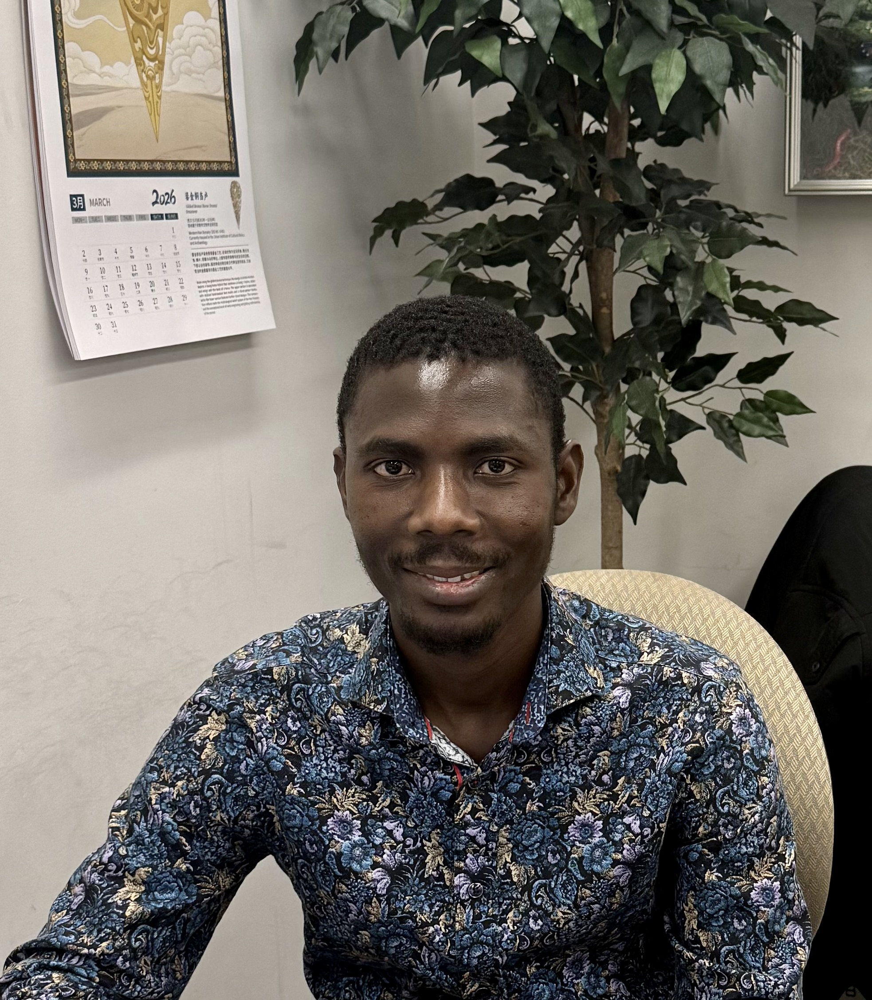

<meta name="google-site-verification" content="ULV_J0BnATRyuGrwuWTxy5uS-eLN6DV99JcSEfEQd_4" />

<!-- Left column -->

<h2 style="margin-bottom: 5px;">Joseph Baafi, PhD</h2>

 Postdoctoral Fellow in Mathematical Biology  Climate-Driven Ecological &amp; Infectious Disease Modeling 

<a class="btn btn-primary" href="cv.pdf">Download CV</a>
<a class="btn btn-secondary" href="https://github.com/jbaafi">GitHub</a>
<a class="btn btn-secondary" href="https://www.linkedin.com/in/josephbaafi/">LinkedIn</a>
<a class="btn btn-secondary" href="mailto:jbaafi@mun.ca">Email me</a>

<!-- Right column -->

<h2>Welcome 👋</h2>

 I am a mathematical biologist and Postdoctoral Fellow at York University, specializing in climate-driven models of mosquito population dynamics. My research integrates temperature, rainfall, and photoperiod to better understand vector ecology, overwintering dynamics, and the effects of environmental change on mosquito abundance and disease risk. 

 I completed my PhD in Mathematical Biology at Memorial University of Newfoundland, where I was supervised by <a href="https://ahurford.github.io/website/" target="_blank" style="text-decoration: none;">Dr. Amy Hurford</a>. My doctoral work focused on developing and analyzing mechanistic models to study seasonal mosquito dynamics and their implications for vector control. 

 I work at the intersection of deterministic and stochastic modeling, ecological systems analysis, and climate-data integration. I have expertise in R and LaTeX, working knowledge of Python and its scientific libraries, and experience in scientific computing with Git/GitHub and in macOS and Linux environments. 

 I also have experience teaching undergraduate mathematics and R programming, and mentoring students in research, data analysis, and scientific communication. 

 Learn more about my projects and findings in the <a href="research.html">Research</a> section. 

